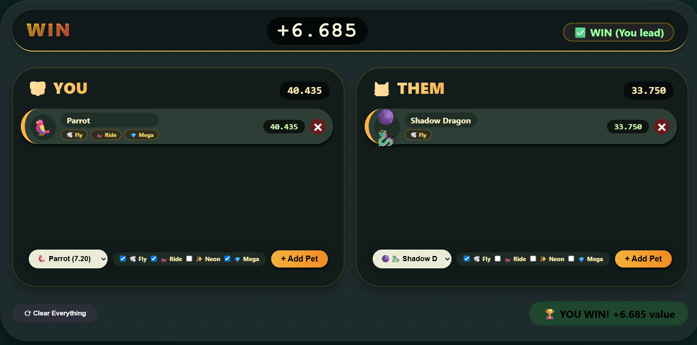
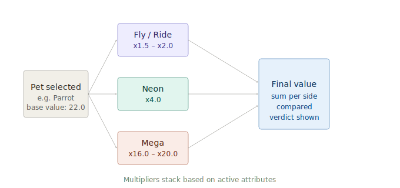
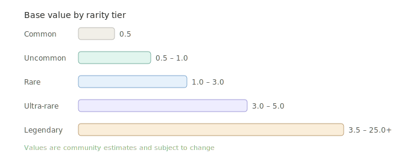

<div align="center">

# AdoptMeValue

**Desktop utility for evaluating and comparing pet values in Adopt Me!**


</div>

---

## Overview

AdoptMeValue is a standalone application that provides real-time valuation of in-game pets from the Roblox title *Adopt Me!*. The application allows users to build a comparison on both sides, apply attribute multipliers, and receive an immediate quantitative result — eliminating ambiguity from the evaluation process.

The value database is stored in a local `pets.json` file, making it straightforward to update as the community meta evolves.

---

## Screenshots

<div align="center">


*Main interface*

</div>

---

## How It Works

### Value calculation

Each pet carries a numeric base value. When attributes such as Fly, Ride, Neon, or Mega are applied, the application multiplies the base value by the corresponding coefficient defined in the data file.



### Rarity tiers

Pets are categorized into five rarity tiers. Base values are distributed across these tiers as follows:



---

## Attribute Multipliers

| Attribute | Multiplier |
|-----------|-----------|
| Fly | ×1.5 |
| Ride | ×1.5 |
| Fly + Ride | ×2.0 |
| Neon | ×4.0 |
| Neon + Fly + Ride | ×6.0 |
| Mega | ×16.0 |
| Mega + Fly + Ride | ×20.0 |

---

## Features

- **Instant value comparison** — calculates and displays the value delta between both sides in real time
- **Comprehensive pet database** — includes Common through Legendary pets, with support for limited and event-exclusive entries
- **Attribute-aware valuation** — Fly, Ride, Neon, and Mega states are factored into the final value automatically
- **Multi-pet support** — each side of the comparison supports multiple pets simultaneously
- **Outcome indicator** — a clear result is displayed at the top of the interface, along with the numeric difference
- **One-click reset** — clears both sides instantly for a new comparison
- **Portable** — no installation required;

---

## Getting Started

### System Requirements

- Windows 10 or later (64-bit)
- No additional runtime dependencies

### Installation

1. Download the latest release from the [Releases](../../releases) page
2. Extract the archive to any directory with **1234**
3. Launch

### Usage

1. On the **YOU** side, select your pet from the dropdown and enable any applicable attributes
2. On the **THEM** side, configure the other player's offer in the same manner
3. Click **+ Add Pet** to include additional pets on either side
4. The application computes totals and displays a verdict automatically

---

## Project Structure

```
AdoptMeTradesValue/
├── app/                        # Application binary (distributed via Releases)
├── data/
│   └── pets.json               # Pet value database
└── README.md
```

### `pets.json` schema

```json
{
  "version": "1.0.0",
  "multipliers": {
    "fly": 1.5,
    "ride": 1.5,
    "neon": 4.0,
    "mega": 16.0
  },
  "pets": [
    {
      "id": "shadow_dragon",
      "name": "Shadow Dragon",
      "rarity": "legendary",
      "base_value": 25.0,
      "obtainable": false,
      "attributes": { "fly": true, "ride": false }
    }
  ]
}
```

---

## Contributing

Community contributions to the value database are welcome. If a pet's value has shifted or a new pet has been released:

1. Fork this repository
2. Edit `data/pets.json` with the updated or new entry
3. Submit a Pull Request with a brief description of the change and its source

Please base value updates on widely referenced community sources to maintain consistency.

---

<div align="center">

Built for the Adopt Me! community &nbsp;·&nbsp;

</div>
